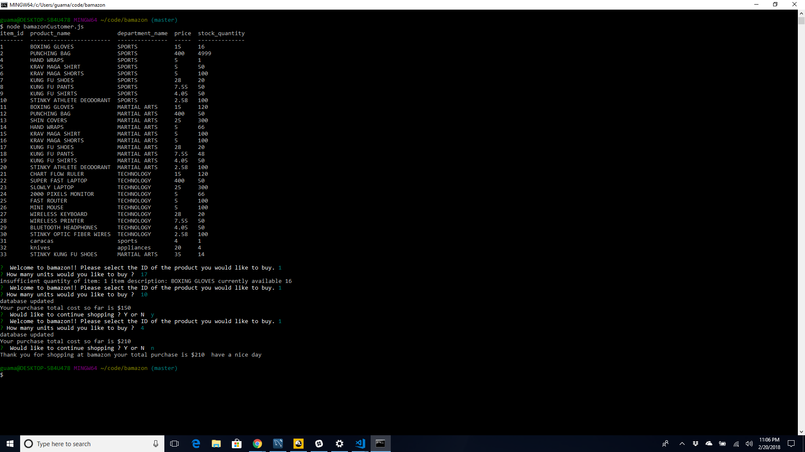
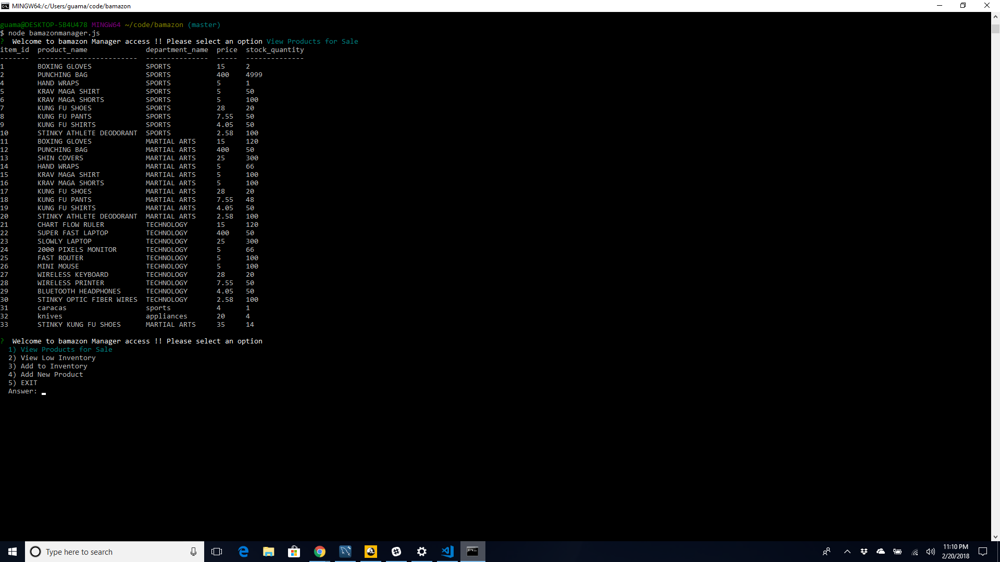

# bamazon

This is an Amazon-like storefront built on Node.js & MySQL. The app will take in orders from customers and deplete stock from the store's inventory.
### **Customer Actions**

1. Using your bash terminal, run bamazonCustomer.js

   ```
   $ node bamazonCustomer.js
   ```

1.  The app should then prompt users with two messages.

    The first should ask them the ID of the product they would like to buy.
    The second message should ask how many units of the product they would like to buy. Follow the on-screen prompts to place an order.

   

1. The application checks if the store has enough of the product, you will be notified and the order will may or may not be placed. 

   

1. Using your terminal, run bamazonManager.js
    
   If a manager selects View Products for Sale, the app should list every available item: the item IDs, names, prices, and quantities.

   

   If a manager selects View Low Inventory, then it should list all items with an inventory count lower than five.

   

   If a manager selects Add to Inventory, your app should display a prompt that will let the manager "add more" of any item currently in the store.

   

   If a manager selects Add New Product, it should allow the manager to add a completely new product to the store. 

   